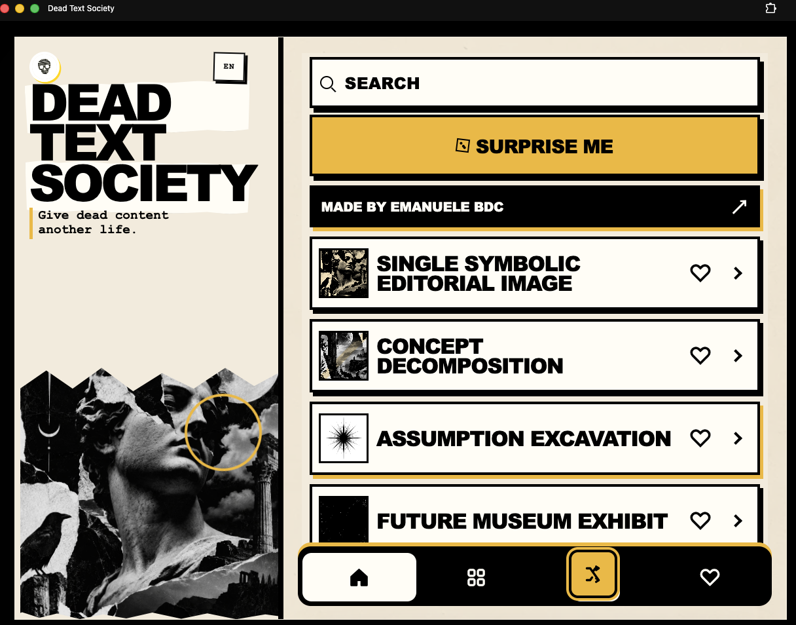
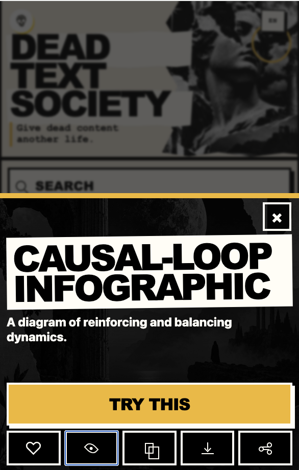

# DEAD TEXT SOCIETY

**Give dead content another life.**

[**OPEN THE APP →**](https://emaf205.com/ideas/dead-text-society/)

---

## WHY

I teach AI and record my lessons.

**Recording → Transcript → Summary → Blog**

Useful.

But I wanted more.

**Same source → new angles → new formats → new ideas**

So I built **Dead Text Society**.

## WHAT IT DOES

**142 transformations** for existing content.

Use it on:

**transcripts · notes · PDFs · articles · research · lessons**

Turn them into:

**stories · critiques · visual concepts · future scenarios · maps · lessons · strange connections**

## HOW

**CHOOSE → COPY → ADD YOUR SOURCE → RUN**

Works with **ChatGPT · Claude · Gemini · NotebookLM · and other AI tools**.

Output follows the user's language.

---

## INSIDE

**142 prompts → Search → Categories → Surprise → Favorites**

**Offline → No account → No backend**

## WEB

[**OPEN DEAD TEXT SOCIETY →**](https://emaf205.com/ideas/dead-text-society/)

## LOCAL

`index.html`

---

**DEAD TEXT SOCIETY**  
**BY [EMANUELE BDC](https://linktr.ee/emaf205X)**

© 2026 Emanuele BDC. All rights reserved.
